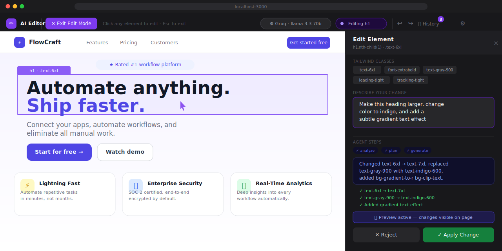

# ✏ AI Website Editor

> Click any element on any website. Describe a change in plain English. Watch it happen.

[](LICENSE)
[](backend/requirements.txt)
[](backend/requirements.txt)
[](package.json)
[](docker-compose.yml)
[](README.md)

Open-source visual AI editor that works on **any website** via a single `<script>` tag.
No account. No subscription. Bring your own free API key.

---

## Demo



> **What you see above:** Edit Mode is active (top toolbar). A `h1` heading is selected (purple outline). The right panel shows the AI agent's 3-step pipeline (analyze → plan → generate) and the proposed change. Click **Apply** to patch the live DOM — or **Reject** to discard.

---

## ✦ Quick Start (one command)

```bash
git clone https://github.com/shrinivasbizz-sketch/ai-website-editor
cd ai-website-editor/backend
pip install -r requirements.txt
python main.py
```

Open **http://localhost:8000** → get your script tag → add to any website.

---

## Add to your website

```html
<!-- Paste before </body> on any HTML page -->
<script src="http://localhost:8000/inject.js"></script>
```

That's it. An editor toolbar appears at the top of the page.

---

## How it works

```
Your website  →  inject.js  →  Python Agent  →  Your AI provider
(any page)       (1 script)    (3-step agent)    (Groq/Gemini/Ollama)
```

**3-step AI agent pipeline:**
1. **Analyze** — understand what the selected element is and what the user wants
2. **Plan** — decide exact HTML/CSS/Tailwind changes to make
3. **Generate** — produce the modified HTML (retries if output is invalid)

---

## Supported AI Providers

Each user configures their own key — you pay nothing for their usage.

| Provider | Free Tier | Sign Up |
|---|---|---|
| **Groq** | ✅ 14,400 req/day | [console.groq.com](https://console.groq.com) |
| **Google Gemini** | ✅ 1M tokens/day | [aistudio.google.com](https://aistudio.google.com) |
| **OpenRouter** | ✅ Free models | [openrouter.ai](https://openrouter.ai) |
| **Ollama** | ✅ Unlimited local | [ollama.com](https://ollama.com) |
| OpenAI | ❌ Paid | [platform.openai.com](https://platform.openai.com) |
| Anthropic | ❌ Paid | [console.anthropic.com](https://console.anthropic.com) |

Keys stay **in the user's browser only** — never sent to your server.

---

## Share with your team

### Docker (everyone runs their own copy)

```bash
docker compose up --build
```

### Deploy free to cloud (one URL for the whole team)

| Service | Deploy |
|---|---|
| Python agent | [Railway](https://railway.app) — connect GitHub → select `/backend` |
| Next.js UI (optional) | [Vercel](https://vercel.com) — set `NEXT_PUBLIC_AGENT_URL` |

### Bookmarklet (no code changes needed)

Visit `http://localhost:8000` and drag **✏ AI Editor** to your bookmarks bar.
Works on any website without touching its source code.

---

## Features

- Works on any website — React, Vue, Next.js, plain HTML, WordPress, anything
- Visual element selection with hover preview and purple highlight
- Natural language editing — "make this button red and add shadow"
- Live DOM preview before applying changes
- Undo/redo with full revision history panel
- Tailwind CSS aware — preserves responsive prefixes (sm:, md:, lg:)
- BYOK — each user brings their own free API key, stored only in their browser
- 3-step agent pipeline with retry and validation
- React component name detection via fiber walk
- No account, no subscription, self-hostable
- MIT licensed

---

## Project Structure

```
backend/            ← Python agent (standalone — the core product)
  main.py           ← FastAPI + serves inject.js + setup page
  agent.py          ← 3-step AI pipeline (analyze → plan → generate)
  llm.py            ← Multi-provider abstraction (BYOK)
  static/inject.js  ← Universal client script (~500 lines, zero deps)
  Dockerfile
  railway.toml      ← One-click Railway deploy

app/                ← Optional Next.js rich UI
  page.tsx          ← Demo SaaS landing page (FlowCraft)
  api/editor/       ← API route → Python agent with direct LLM fallback
components/editor/  ← EditModeOverlay, EditPanel, HistoryPanel
store/              ← Zustand stores (provider config, editor state)
public/
  demo.svg          ← UI mockup (this README's screenshot)
```

The Python `backend/` is the complete standalone product.
The Next.js app is optional and adds a richer browser-based interface.

---

## API

```
GET  /              Setup & onboarding page (get your script tag here)
GET  /inject.js     Universal client script
GET  /health        Health check
POST /generate      AI editing endpoint (BYOK)
GET  /api/docs      Swagger / OpenAPI docs
```

**POST /generate payload:**
```json
{
  "prompt": "make this heading blue and larger",
  "elementHtml": "<h1 class=\"text-6xl font-extrabold\">Hello</h1>",
  "outerHtml": "<section class=\"hero\">...</section>",
  "classes": ["text-6xl", "font-extrabold"],
  "tag": "h1",
  "providerConfig": {
    "provider": "groq",
    "apiKey": "gsk_...",
    "model": "llama-3.3-70b-versatile"
  }
}
```

---

## Contributing

PRs welcome. Fork → branch → PR.

**Good first issues:**
- Add a new AI provider to `backend/llm.py`
- Export edited page as static HTML/CSS file
- Browser extension (Chrome/Firefox) wrapper for `inject.js`
- VS Code plugin integration
- Test suite for the agent pipeline

---

## License

[MIT](LICENSE) — free to use, modify, and deploy commercially.
